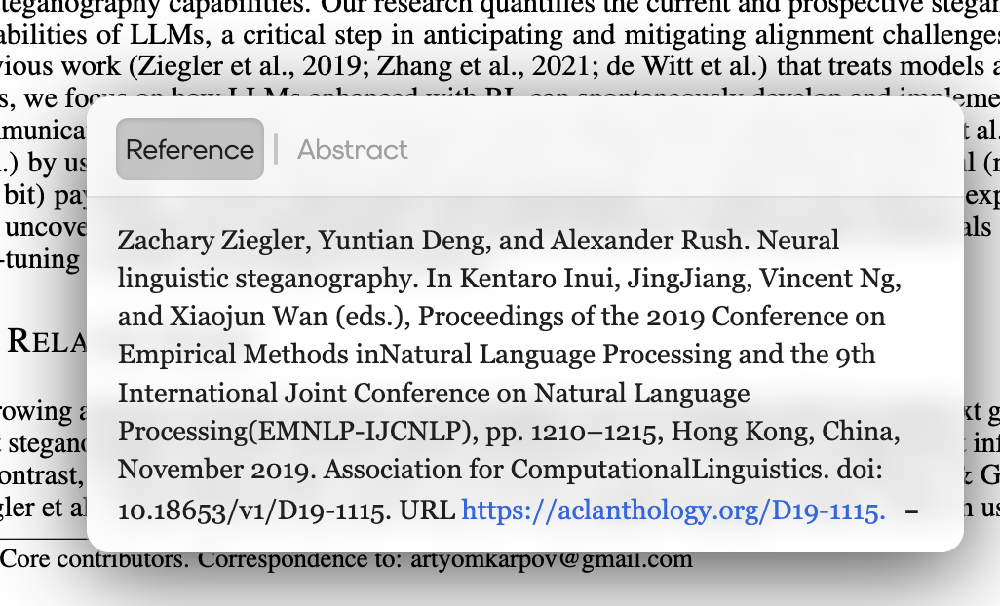
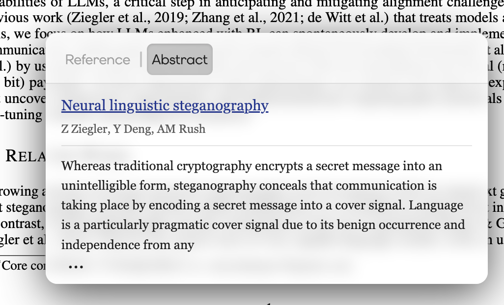
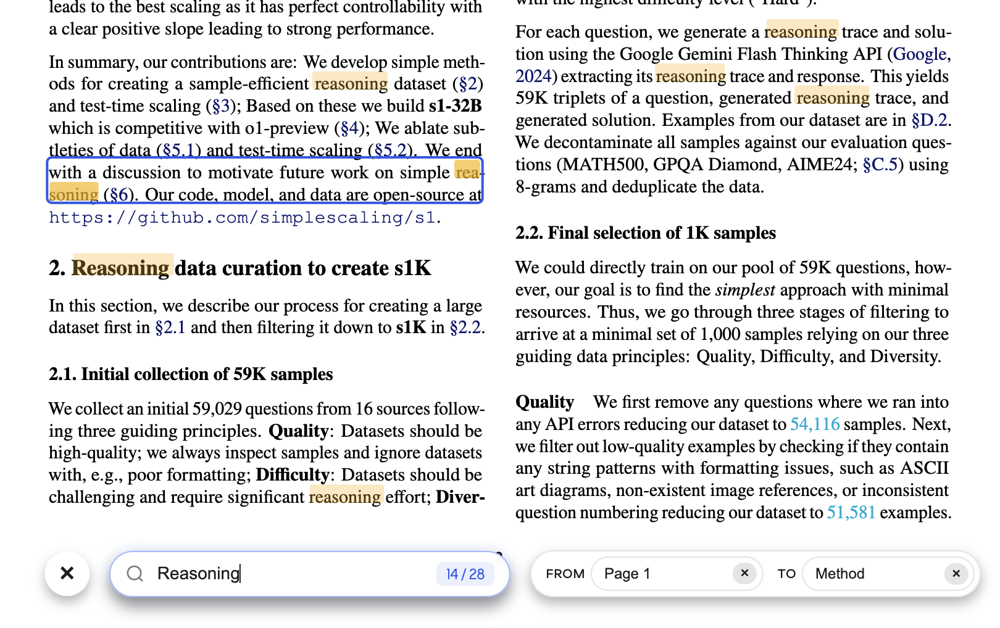
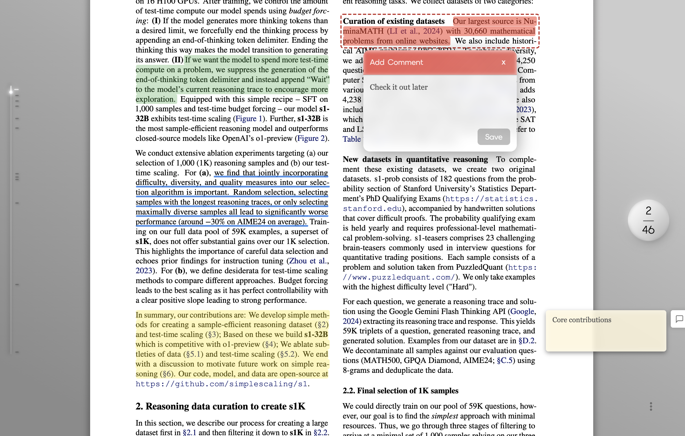
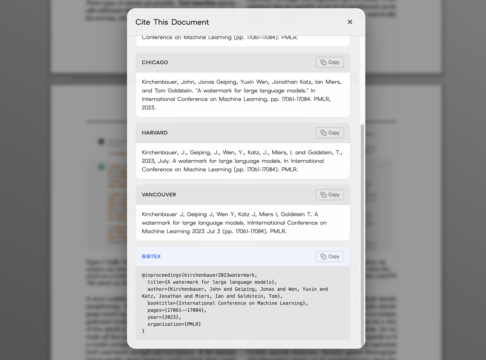
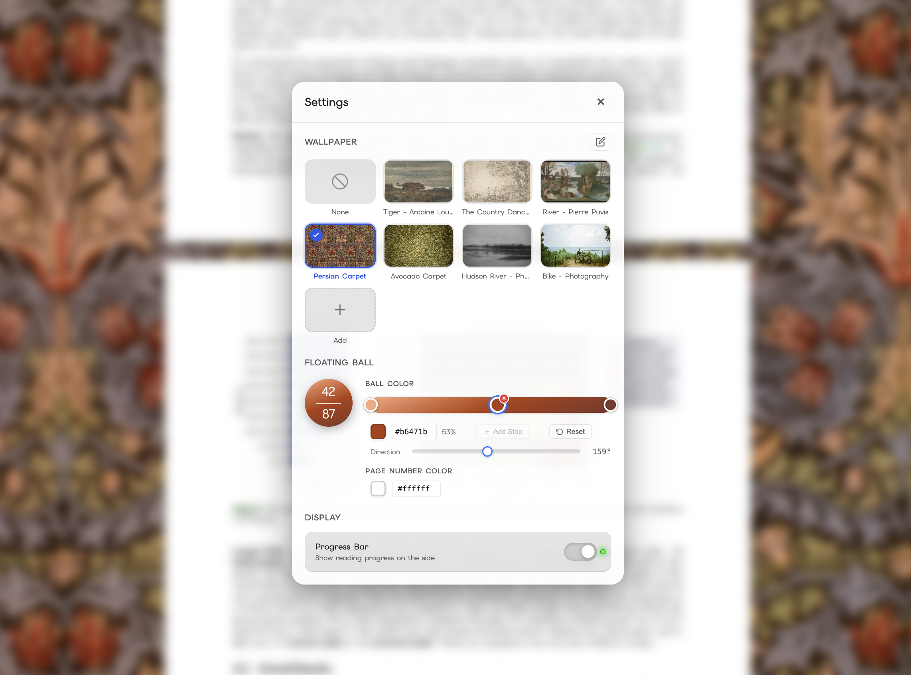

<p align="center">
  
</p>

<h1 align="center">Hover — An immersive PDF Reader Extension</h1>

Hover is a minimalist PDF reader browser extension designed for people who spend way too much time reading academic papers in the browser.

It intentionally keeps only the most essential features, but aims to make the actual experience of reading papers smoother, faster, and more immersive
by introducing a **carefully designed UI system** for desktop reading based on a single ball-shaped controller.
Every action and command revolves around the single controller, and everything irrelevant to reading fades into the background.

**Currently the main functionalities only works on LaTeX compiled PDF documents. But heuristic parsing will be supported later for all kinds of papers.**

The project is built with Vanilla JS and is dependent on [Embed PDF](https://www.embedpdf.com/)'s engine and Pdfium.

<small>\*A significant portion of the codebase was developed with AI assistance; however, the author has 100% audited the code.</small>

---

## Features

### 1. Inline Citation Preview

The main goal of creating Hover is to solve the problem of LaTeX citation links that direct you straight to the references when reading most STEM papers.
Hover solves this problem by searching the nearest reference based on the coordinates linked to the citation.

Just hover your mouse on the citation link, the content of the citation would appear right at the spot.
You can even directly open up the URL in the citation or check out the abstract of the paper extracted from Google Scholar.

| Actual reference                                | Google Scholar Abstract                         |
| ----------------------------------------------- | ----------------------------------------------- |
|  |  |

### 2. Innovative Navigation System

<br>
<p align="center">
    PDF readers are boring as hell.
</p>
<br>

Hover introduces a compact yet beautifully designed navigation system that works just like magic.
It all starts with a ball:

<p align="center">

</p>

- **Left-click**: open the full mini toolbar which includes **dark mode**, **split window**, **spread mode**, **fit screen**, and **zoom in/out**.

<p align="center">

</p>

- **Double-click**: go to top
- **Drag it vertically**: scroll the document
<p align="center">

</p>

- **Drag it to the left**: expose the table of content that also tracks your annotations
<p align="center">

</p>

Everything you need for focused reading stays right under your finger.

### 3. Split Window Mode

Sometimes you gotta wonder, PDFs are longer than codes, so why isn't there a split window mode for most PDF readers?

Hover enables split window mode for a single document.
No more jumping between experiment results and metrics or figures and methodologies, enjoy doubling your reading speed without wasting time on scrolling around.

<p align="center">

</p>

### 4. Full Dark Mode

Pulling an all-nighter reading papers sounds fun, especially when the white background lights up your entire bedroom.
With a click of the button, Hover not only turns the background in a soft dark tone, it also renders the contents black.

<p align="center">

</p>

### 5. Search with Range

Not only is the search more accurate than the default readers as it can detect phrases broken by lines and columns, it also enables you to search with a specific range.

<p align="center">

</p>

### 6. Persistent Annotation

Annotations you made in this reader are embedded into the PDF document, no need for any accounts or the cloud to save annotations or to share them with others.

<p align="center">

</p>

### 7. Direct Bibtex Access

Get bibtex and citations in other formats with just one click of a button.

<p align="center">

</p>

### 8. Appearance Customization

Customize wallpaper from image files or URLs and pick the color of the navigation ball to create your own themed PDF reading experience.

<p align="center">

</p>

### 9. VIM Motion

Full vim motion support for reading, highlighting, and citation preview (under development, currently only support HJKL).

---

## Installation

This project will be released as a browser extension for Chrome and Safari.

Latest commit is always runnable so you can clone the repo and use npm to build and load it in Chrome.
Make sure you install the dependencies using

```bash
npm install
```

And then use

```bash
npm run build:ext
```

Open Chrome, navigate to [Chrome extension management](chrome://extensions/), turn on developer mode and load the _dist_ folder to use the extension.

---

## Buy Me a Coffee

If you love using Hover like I do, please consider support me here:

[](https://www.buymeacoffee.com/chihshengj)

Every donation means a ton to me and to this project!

And if there are any bugs or possible improvements of the codebase, feel free to open an issue.

---

## Road map

- Heuristic parsing to extract links from non-LaTeX compiled PDFs.
- **Hover for Safari**
- Improve indexing performance and memory usage
- Theme configuration

---

## License

Apache 2.0 with common clause. This project will stay open sourced and free to use, commercial use of the source code is highly discouraged.

---
