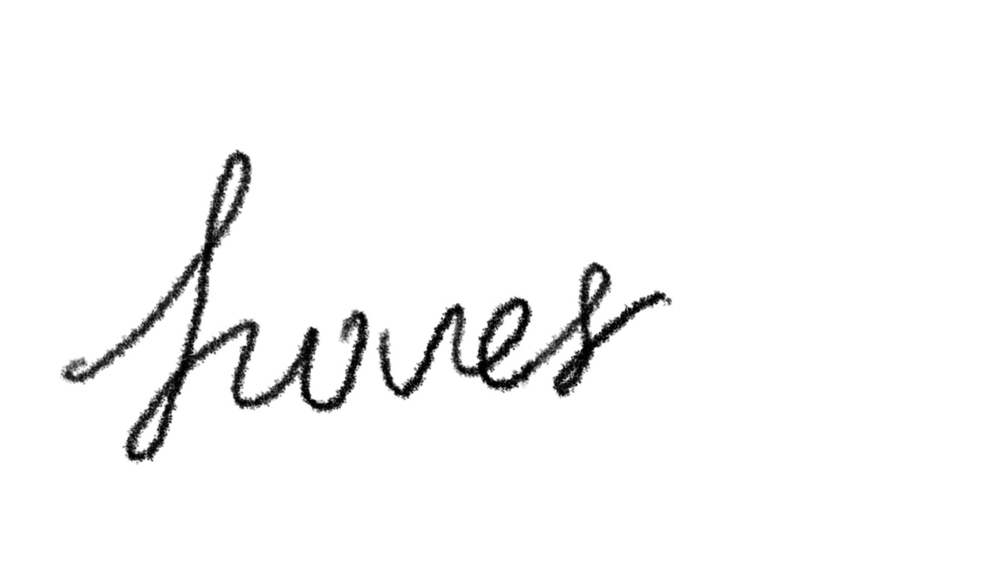

  

<h1 align="center">Hover — A Super Lightweight PDF Viewer Extension</h1>

  

Hover is a minimalist PDF viewer extension designed for people who spend way too much time reading academic papers in the browser.
It intentionally keeps only the most essential features, but aims to make the actual _experience_ of reading papers smoother, faster, and uninterrupted by ---

You've guessed it: **Hopping over the content and the references**  
Hover solves that with inline citation preview popups that appear exactly where your cursor hovers, and lets you jump directly to the referenced paper in a new tab with one click.

The project is based on PDFjs, which means that you can also directly access the texts as html elements, if you're interested in taking advantage of this feature, feel free to fork it!

---

## ✨ Features

### 📎 Inline Citation Preview

Just hover your mouse over a citation and Hover  
→ instantly shows the full reference **right there**, in-context.  
And if the citation has a reachable URL or DOI?  
→ **Jump straight to the cited paper.**

### ⚫ Floating Ball Navigation (Immersive Mode)

Hover introduces a small draggable floating ball that acts as your navigation hub.

- **Drag it vertically** → scroll the document
- **Single click** → go to the **previous page**
- **Double click** → go to the **next page**
- **Left-click & hold** → open the **full mini toolbar**

It sounds silly, but it really makes paper reading feel more direct and tactile.

### 🛠️ Mini Toolbar

When expanded, the floating toolbar gives you the essentials:

- 🔍 **Zoom In**
- 🔎 **Zoom Out**
- 🖱️ **Text Selection Toggle**
- ✋ **Drag/Pan Mode**

### 🧪 Under Active Testing

Hover already works nicely for most papers, but:

- Some PDFs don’t render citations perfectly yet (working on it!)
- Mobile support is in development
- More stability improvements and accessibility features are coming

---

## 📦 Installation

The project will be released as a browser extension.

---

## 🚧 Roadmap (Short Term)

- Improve robustness for complicated PDFs
- Smarter citation detection + fallback behavior
- Mobile version
- Better zooming and smoother scroll handling
- Optional dark/light theme
- Configurable citation preview styling
- Theme configuration
- Optimized rendering without glitching

---

## 📝 License

MIT

---
