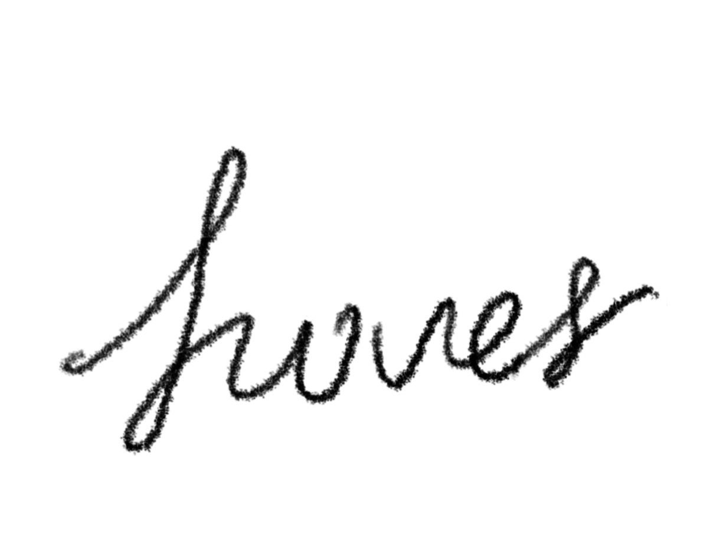
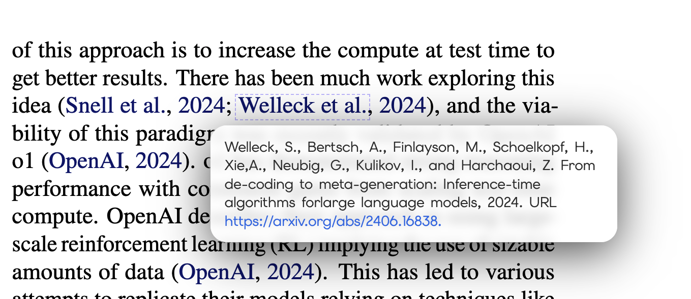
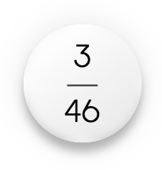
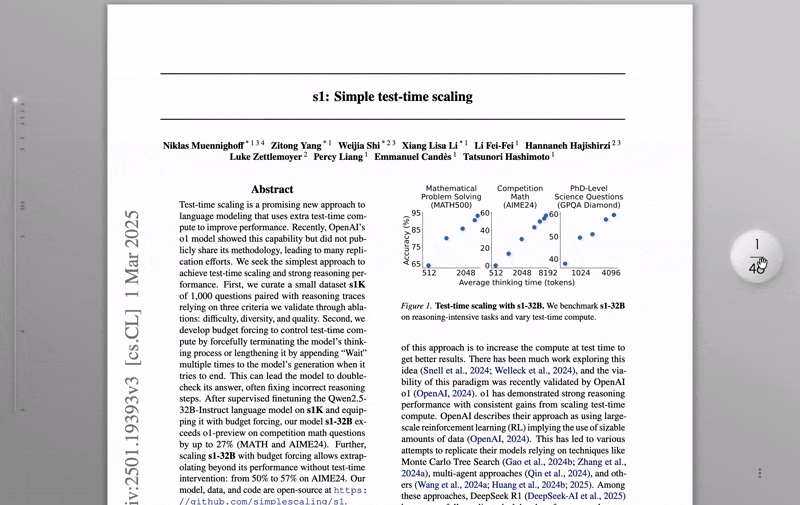
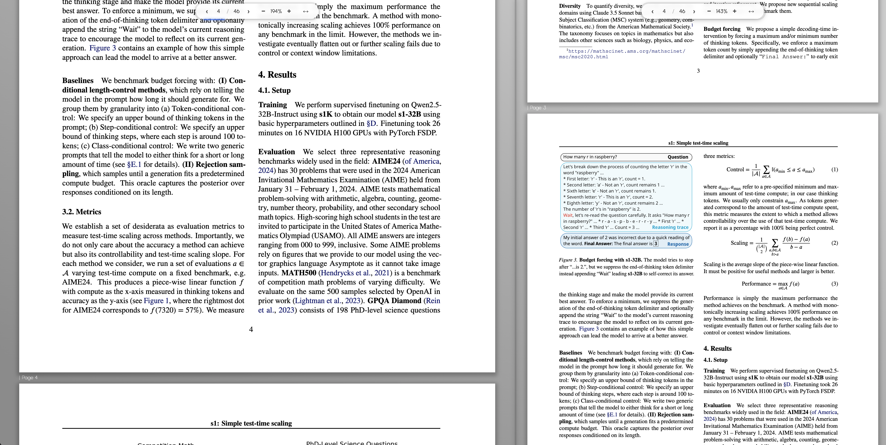
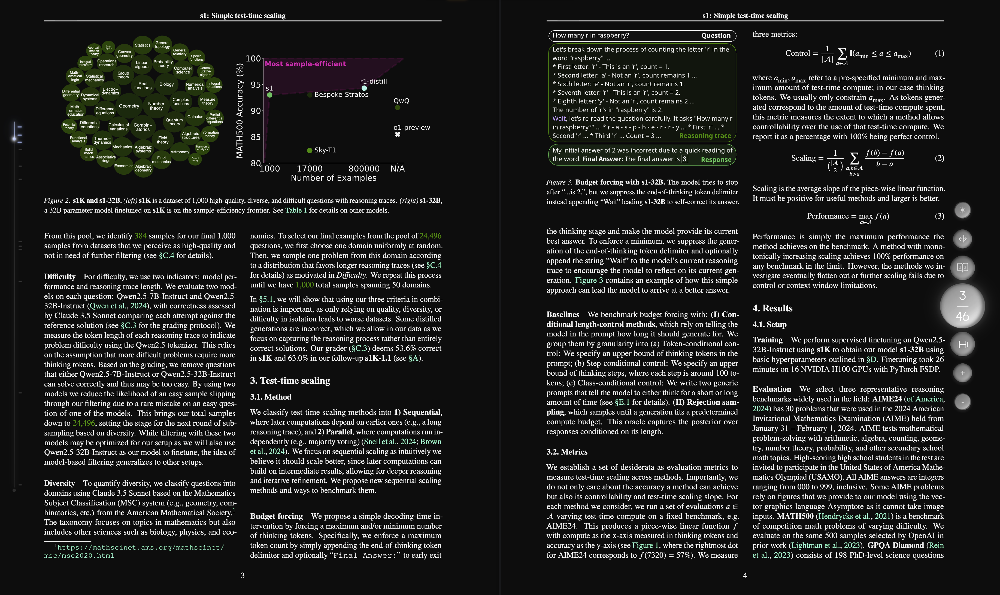

<p align="center">
  
</p>

<h1 align="center">Hover — A Lightweight PDF Reader Extension</h1>

Hover is a minimalist PDF reader extension designed for people who spend way too much time reading academic papers in the browser.
It intentionally keeps only the most essential features, but aims to make the actual experience of reading papers smoother, faster, and more immersive by ---

You've guessed it: **Hopping between the content and the references**  
Hover solves this problem by providing a pop-up window that gives you the access to the text of the references directly, allowing you to jump directly to an ArXiv paper, or search the title in Google Scholar.

Beyond that, with the detailed modern UX design, Hover creates the most intuitive, fluid reading experience to maximize your knowledge intake, a barely noticeable handy tool that always sits right under your palm.

The project is based on [PDF.js](https://github.com/mozilla/pdf.js), which means that you can also directly access the texts as HTML elements, if you're interested in taking advantage of this feature, feel free to fork this project!

---

## Features

### Inline Citation Preview

Hover's main purpose is to solve the problem of LaTeX citation links that direct you straight to the references when reading most scientific papers.
This process is highly disruptive to the flow of reading, but hard to tackle with in practice since the hyperlink in LaTeX usually only contains the positional information within the document.
Hover solves this problem by heuristically parsing the PDF annotations and finding the text content of the citation.

Just hover your mouse on the citation link, the content of the citation would appear right at the spot.
You can even directly open up the URL in the citation or search the title of cited document in Google Scholar (yeah I ripped them off).

<p align="center">

</p>

### Innovative Navigation System

PDF readers are boring as hell.

Hover introduces a compact yet beautifully designed navigation system that works just like magic.
It all starts with a ball:

<p align="center">

</p>

- **Left-click**: open the full mini toolbar which includes **dark mode**, **split window**, **hand tool/cursor**, **horizontal spread**, and **zoom in/out**.

<p align="center">

</p>

- **Double-click**: go to the first page
- **Drag it vertically**: scroll the document
<p align="center">

</p>

- **Drag it to the left**: expose the table of content that also tracks your annotations
<p align="center">

</p>

The functionalities are kept at their minimum, but your interaction with the document is more fluid and intuitive than ever.

### Split Window Mode

Sometimes you gotta wonder, PDFs are longer than codes, so why isn't there a split window mode for most PDF readers?

Hover enables split window mode for a single document.
No more jumping between experiment results and metrics or figures and methodologies, enjoy doubling your reading speed without wasting time on scrolling around.

<p align="center">

</p>

### Full Dark Mode

Pulling an all-nighter reading papers sounds fun, especially when the white background lights up your entire bedroom.
With a click of the button, Hover not only turns the background in a soft dark tone, it also renders the contents black.

<p align="center">

</p>

### Persistent Annotation

Annotations you made in this reader are embedded into the PDF document, no need for any accounts and cloud to save annotations or to share them with others.

### VIM Motion

Full vim motion support for reading, highlighting, and citation preview (under development).

---

## Installation

This project will be released as a browser extension for Chrome, Safari, and Firefox.

Latest commit is always runnable so you can clone the repo and use npm to build and load it in Chrome.
Make sure you install the dependencies using

```bash
npm install
```

And then use

```bash
npm run build:ext
```

Open Chrome, navigate to [Chorme extension management](chrome://extensions/) and load the _dist_ folder to use the extension.

---

## Road map

- Fuzzy search with range
- Improve Safari support
- Improve performance and memory usage
- Accommodation for Lefties
- Theme configuration

---

## License

Apache 2.0 with common clause. This project will stay open source and free, commercial use of the source code is highly discouraged.

---
