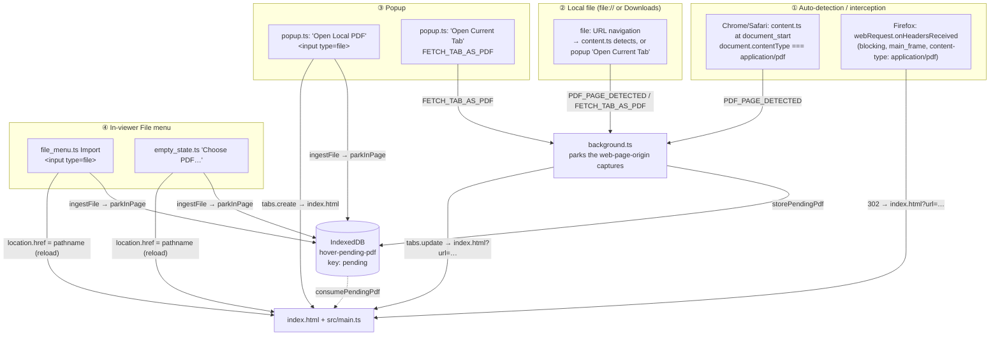
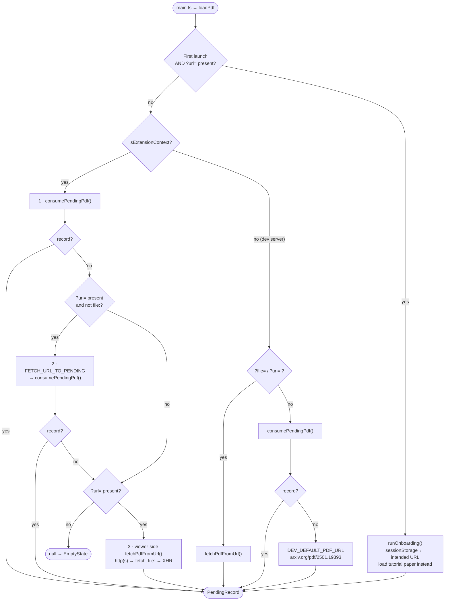
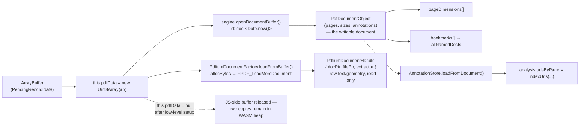
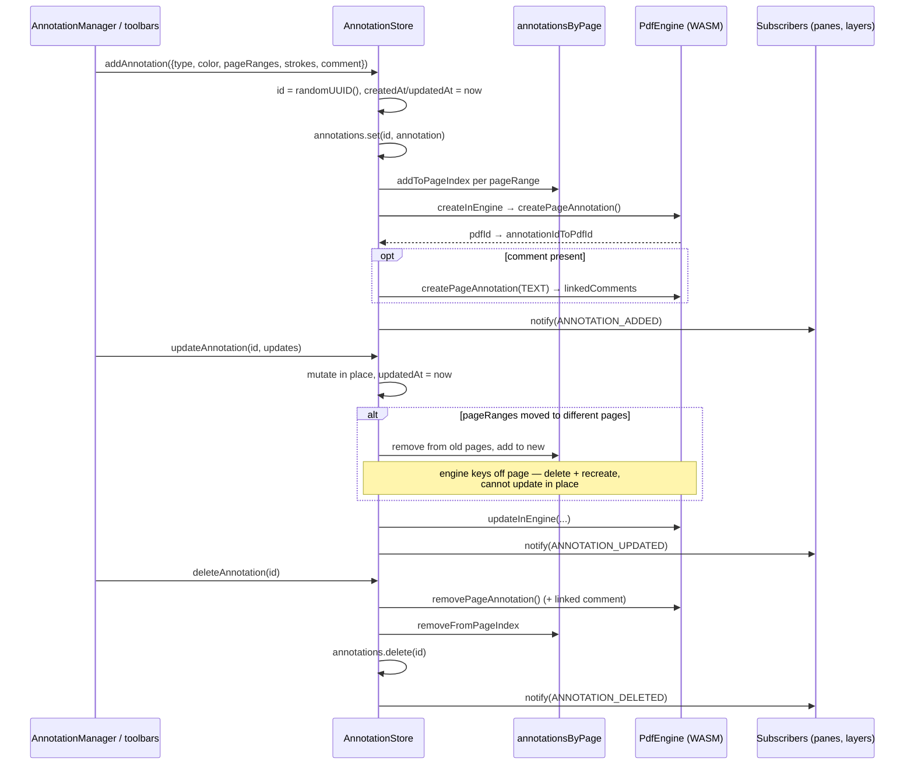
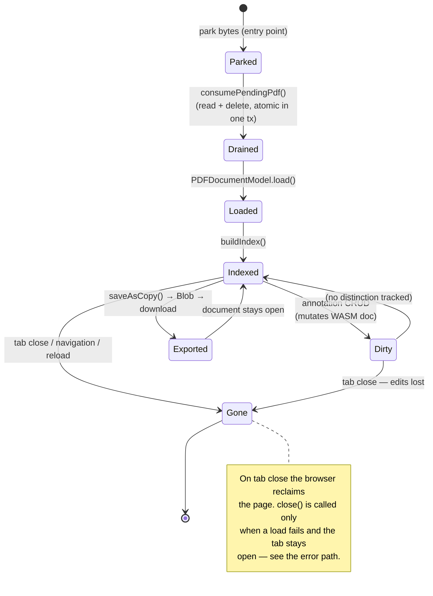

# The Lifecycle of a PDF in Hover

How a PDF gets in, what it becomes while it is open, how edits are applied, and
what happens when it goes away.

Everything below is derived from the code as of `0.10.4`. File references are
`path:line`-ish and point at the function that owns the behaviour.

---

## 0. Vocabulary

| Term                 | Meaning                                                                                                      |
| -------------------- | ------------------------------------------------------------------------------------------------------------ |
| **Park**             | Write PDF bytes into the pending store so a _future_ viewer tab can pick them up.                            |
| **Drain**            | Read-and-delete the pending record. Destructive by design (`consumePendingPdf`).                             |
| **Pending store**    | IndexedDB `hover-pending-pdf` / store `data` / key `"pending"`. One record, overwritten each time.           |
| **Viewer**           | `index.html` + `src/main.ts`, running on the extension origin.                                               |
| **Engine doc**       | The `PdfDocumentObject` owned by `@embedpdf/engines`' `PdfEngine`.                                           |
| **Low-level handle** | A _second_, independent `FPDF_LoadMemDocument` handle (`PdfiumDocumentHandle`) used for raw text extraction. |

The single contract every entry point converges on is the `PendingRecord`:

```ts
interface PendingRecord {
  data: ArrayBuffer; // the raw PDF bytes
  name: string; // display name, e.g. "2501.19393.pdf"
  url: string | null; // provenance; null for local-file ingests
}
```

`src/platform/ingest.ts` is deliberately the _only_ module that knows this
contract — both the writing half (`parkPdfBytes`, `ingestFile`) and the reading
half (`resolvePdfSource`). The background script re-implements the same three
IndexedDB calls by hand, because it is emitted as a standalone classic script
and cannot `import` shared modules (see the header comment in `background.ts`).

---

## 1. Storage substrates

Nothing about a document is durable except annotations you explicitly **Save**,
and the trail graph. Here is every place bytes or state live:

| Store             | Backend                                        | Key(s)                                                      | Lifetime                             | Holds                                       |
| ----------------- | ---------------------------------------------- | ----------------------------------------------------------- | ------------------------------------ | ------------------------------------------- |
| Pending PDF       | IndexedDB `hover-pending-pdf`                  | `"pending"`                                                 | Until the next viewer load drains it | `PendingRecord` (ArrayBuffer)               |
| Engine doc        | PDFium WASM heap                               | —                                                           | Tab lifetime                         | Parsed document + annotation edits          |
| Low-level handle  | PDFium WASM heap (`filePtr`, `docPtr`)         | —                                                           | Tab lifetime                         | A second copy of the same bytes             |
| Rendered pixels   | `<canvas>` 2D contexts                         | per `PageView`                                              | Until re-render/scroll               | `ImageData` from `renderPageRaw`            |
| Extension prefs   | `chrome.storage.local`                         | `hoverEnabled`, onboarding key, `hover-pending-connections` | Permanent                            | Toggles, trail hand-offs                    |
| Config            | `chrome.storage.local` + `localStorage` mirror | per-setting                                                 | Permanent                            | Theme, wallpaper, night-mode                |
| Onboarding detour | `sessionStorage`                               | `INTENDED_URL_KEY`                                          | Tab session                          | The URL you actually wanted on first launch |
| Trails            | IndexedDB `hover-trails`                       | per trail                                                   | Permanent (capped at 8)              | Reading-graph nodes                         |
| Saved output      | User's filesystem                              | —                                                           | Permanent                            | `saveAsCopy()` bytes via `<a download>`     |

> **The PDF file itself is never persisted by Hover.** The pending record is
> consumed on first read, and the in-memory document dies with the tab.

---

## 2. The four entry points

All four converge on the same two-part hand-off: _park bytes (or a URL) →
navigate to `index.html` → viewer drains_. They differ only in **who acquires
the bytes** and **whether bytes exist at navigation time**.



### ① Background auto-detection — two strategies

**Chrome / Safari (`content.ts`)**

The content script runs at `document_start` on `<all_urls>`. It bails unless
`document.contentType === "application/pdf"`, then immediately injects a
`visibility: hidden` style + a full-screen dark overlay so the native viewer
never flashes. It messages `PDF_PAGE_DETECTED` and acts on the reply:

| Reply `action`       | Meaning                                    | Content script does                                                               |
| -------------------- | ------------------------------------------ | --------------------------------------------------------------------------------- |
| `none`               | Toggle off, or a bypass URL                | `restoreNativeViewer()` — strips overlay, unhides body                            |
| `done`               | Background fetched + parked + navigated    | Show "Opening viewer… 100%" and wait for navigation                               |
| `file_access_denied` | `file:` URL without file-scheme permission | Render the "Local File Access Required" prompt                                    |
| `content_fetch`      | Background's fetch failed or wasn't a PDF  | Fetch it **itself** with `credentials: include`, base64 it, send `PDF_DATA_READY` |

The `content_fetch` fallback exists for cookie/session-gated PDFs the service
worker's credential-less `fetch` can't reach. The cost is base64: bytes cross
the message boundary as a string (`arrayBufferToBase64` → `base64ToArrayBuffer`).

**Firefox (`background.ts`, the `chrome.webRequest?.onHeadersReceived` block)**

Firefox never injects content scripts into its built-in pdf.js viewer, so the
content-script takeover cannot fire at all. Instead a _blocking_ `webRequest`
listener inspects main-frame response headers and returns
`{ redirectUrl: index.html?url=… }`. Three constraints are load-bearing:

- The listener **must be synchronous**. On Firefox's non-persistent background,
  a Promise-returning blocking listener races event-page wake-up against the
  pdf.js stream hand-off and the redirect is silently dropped. Hence
  `hoverEnabledCache` is kept in memory and refreshed via `storage.onChanged`.
- `Content-Disposition: attachment` responses are skipped, for parity with
  Chrome where attachments never render and so are never intercepted.
- The whole block is gated on `chrome.webRequest?.onHeadersReceived` existing;
  Chrome/Safari builds don't request the permission, so it is inert there.

A redirect gives a URL but **no body** — so the viewer lands with nothing
parked, and `resolvePdfSource` asks the background to `FETCH_URL_TO_PENDING`.
That deliberately routes Firefox back through the same pending store, so there
is exactly one viewer code path across all three browsers.

### ② Local files

Local PDFs are special because **nothing except the viewer page can read them**:

- `fetch()` rejects the `file:` scheme in both the service worker and content scripts.
- The service worker has no `XMLHttpRequest`.
- An extension _page_ does have XHR, and may use it once the user has granted
  "Allow access to file URLs".

So the background never parks a local PDF. `openLocalPdfInViewer()` checks
`chrome.extension.isAllowedFileSchemeAccess()` (Chrome-only; Safari doesn't
implement it, so `hasFileSchemeAccess()` optimistically returns `true` and lets
the read itself fail), then just navigates to `index.html?url=file://…`. The
viewer's `readFileUrl()` does the actual read via XHR with
`responseType: "arraybuffer"` — note it treats `status === 0` as success, which
is what a successful `file:` read reports.

`resolvePdfSource` explicitly skips the background hand-off for `file:` URLs to
avoid a pointless round trip.

### ③ Popup (`popup.ts`)

Two buttons, and one browser quirk:

- **Open Local PDF** — Chrome/Safari pick inline (`fileInput.click()` →
  `ingestFile` → `tabs.create(index.html)`). **Firefox destroys the toolbar
  popup the instant a native file dialog steals focus**, so its `change` event
  never fires; the Firefox build instead opens a bare viewer tab and lets
  `EmptyState` host the picker in a tab that survives the dialog. Branch is
  `__TARGET__ === "firefox"` at build time.
- **Open Current Tab** — `FETCH_TAB_AS_PDF` asks the content script to
  `findAndFetchPdf()`: try the page URL itself, then `#pdf-iframe`, then any
  `iframe[src]` whose path contains "pdf", then `embed[type=application/pdf]`.
  First candidate whose first five bytes are `%PDF-` wins.

### ④ In-viewer File menu / empty state

`FileMenu.load(file)` and `EmptyState`'s input both call `ingestFile(file)`
(type-checked against `application/pdf`) and then **reload the viewer** with
`window.location.href = window.location.pathname` — dropping `?url=` so the
reloaded viewer drains the freshly parked record instead of re-fetching the old
URL.

---

## 3. Resolution: what am I opening?

`resolvePdfSource()` (`src/platform/ingest.ts`) is the viewer's only question,
and it has a strict precedence order.



Step 3 is a resilience fallback: if the background hand-off produced nothing
because of a messaging hiccup or an event-page restart, the viewer still
renders by fetching directly.

Returning `null` is **normal** in the extension (a viewer tab opened with
nothing queued) and shows `EmptyState`. In dev it means every source came up
empty, which is an error.

---

## 4. From bytes to an open document

`PDFDocumentModel.load(arrayBuffer)` (`src/model/doc.ts`). Note that the bytes
end up loaded into PDFium **twice**, on purpose:



The WASM module itself (`pdfium.wasm`) is fetched once per page and memoised in
module scope by `initPdfiumEngine()` — from `chrome.runtime.getURL("pdfium.wasm")`
in a packaged extension, falling back to the CDN URL in dev (and hard-failing
under `__LOCAL_WASM_ONLY__` for store builds).

**Why two handles?** The `PdfEngine` is the mutable, annotation-aware view; the
low-level handle drives `PdfiumTextExtractor` for character-level text and
geometry that the high-level API doesn't expose. `filePtr` is owned by the
handle — PDFium keeps referencing the buffer for the document's life — and is
freed only in `PdfiumDocumentHandle.close()`.

### Load progress budget

`load()` reports a fixed percentage budget through `onProgress`, mapped to user-
facing strings by `STATUS_MESSAGES` in `main.ts`:

`5 initializing engine` → `5–20 WASM init` → `20–25 parsing` → `35 text
extraction setup` → `40 page dimensions` → `45 bookmarks` → `80 annotations` →
`95 complete`.

### Indexing, after first paint

`buildIndex()` runs _after_ `constructViewer()` and two `requestAnimationFrame`
ticks, so the first page is on screen before the expensive work starts. It
builds `DocumentTextIndex` over a `createPdfPageSource(...)`, then
`analyzeDocument(...)` produces the whole `DocumentAnalysis` (outline,
references, citations, cross-refs, metadata) **wholesale** — nothing writes into
`this.analysis` piecemeal. It is guarded by `indexingState` so it runs once, and
it swallows its own errors (still firing `DocEvent.INDEX_READY`) so a failed
index degrades rather than breaks the viewer. UI subtrees subscribe to
`index-ready` themselves rather than being poked by `main.ts`.

Only after that does `main.ts` resolve the title and initialise the trail system
— which is wrapped in its own try/catch, since trails layer on top of an
already-rendered document.

---

## 5. Read: rendering a page

`PageView.render()` (`src/viewer/page.ts`) is the per-page read path:

1. `native.renderPageRaw(pdfDoc, page, { scaleFactor, withAnnotations: false })`
2. Wrap the result in `new ImageData(...)` and `ctx.putImageData()` onto the
   page's canvas, centred.
3. Rebuild the overlay layers: URL links, citation overlays, cross-ref overlays,
   and the text layer (from `textIndex.getPageLines()`, cached as `_cachedSpans`
   and merely rescaled on zoom).

Note `withAnnotations: false` — **Hover's own annotations are never baked into
the rendered raster.** They are drawn as separate SVG/canvas layers
(`annotation_svg_layer.ts`, `drawing_canvas_layer.ts`), which is what makes them
interactive and re-styleable without a re-render.

---

## 6. Modify: annotations

`AnnotationStore` (`src/model/annotation_data.ts`) maintains a deliberate
two-vocabulary split:

|          | App model                                            | Engine model                             |
| -------- | ---------------------------------------------------- | ---------------------------------------- |
| Geometry | `RatioRect` — fractions of the page, origin top-left | PDF units, origin bottom-left            |
| Colour   | Names (`yellow`, `red`, …)                           | Hex, nearest-match on the way back       |
| Identity | `crypto.randomUUID()`                                | PDFium-assigned id                       |
| Comments | A `comment` field on the annotation                  | A **separate `TEXT` annotation**, linked |

Ratios rather than points is what lets the same annotation render correctly at
any zoom without recomputation.



Two consequences worth being explicit about:

- **Edits mutate the in-WASM engine document immediately.** There is no separate
  annotation database — the PDFium document _is_ the store of record while the
  tab is alive.
- **Nothing is persisted until the user saves.** Close the tab and every
  annotation is gone. `exportAnnotations()` returns the in-memory array but is
  not wired to any durable sink.

Annotations already present in the incoming PDF are read back at load by
`loadFromDocument()`, which walks every page, calls `normalizeAnnotationRects`,
keeps the raw objects in `nativeAnnotationsByPage` (used for URL indexing and
rendering), and translates recognised markup types into the app model — then
`#linkTextAnnotationsToMarkup` re-pairs orphan TEXT annotations with the markup
they comment on.

---

## 7. Save, print, and "view original"

All three are in `file_menu.ts`:

- **Save** — `docModel.saveWithAnnotations()` → `engine.saveAsCopy(pdfDoc)` →
  `new Blob([...], {type:"application/pdf"})` → object URL → synthetic
  `<a download>` click → `revokeObjectURL` after 1s. Filename is
  `document.title` minus a `" - Hover PDF"` suffix, plus `.pdf`.
- **Print** — same `saveAsCopy` bytes, but mounted into a hidden 0×0 iframe,
  `contentWindow.print()`, then torn down. Falls back to `window.print()` on
  error, which prints the _viewer chrome_ rather than the annotated document.
- **View original** — sends `BYPASS_NEXT` (background holds the URL in
  `bypassUrls` for 5s) and opens the URL with a `#hover-bypass` fragment. Both
  halves exist because the two interception strategies check different things:
  Firefox's webRequest listener consults `bypassUrls`, Chrome/Safari's content
  script checks `location.hash`.

---

## 8. Destroy



Three distinct "destroy" events, only one of which is code Hover runs:

1. **The pending record dies on read.** `consumePendingPdf()` does the `get` and
   the `delete` inside one `readwrite` transaction. This is intentional: bytes
   belong to exactly one viewer load, and leaving them behind would make a plain
   reload reopen a document the user already closed.
2. **Stale trail connections are purged** on `onInstalled`/`onStartup`, older
   than 10 minutes.
3. **The document is explicitly closed only on the failure path.**
   `PDFDocumentModel.close()` — `FPDF_CloseDocument`, free `filePtr`, close the
   engine document, clear the analysis and text index — is called from
   `loadPdf`'s `catch` (and from `runOnboarding`'s, for the tutorial model) via
   the `closeQuietly()` helper in `main.ts`. That path matters because the error
   screen **leaves the tab open**: without it, a failure anywhere after
   `load()` — `constructViewer`, `buildIndex`, `getDocumentTitle` — would strand
   two PDFium documents in the WASM heap for as long as the user left the failed
   tab around.

   On the success path nothing calls it, and nothing needs to: the tab going
   away reclaims the whole heap. It does mean there is still no in-place "close
   this document and open another" path — every document switch is a full page
   reload.

---

## 9. Per-browser summary

|                             | Chrome                                                    | Firefox                                 | Safari                             |
| --------------------------- | --------------------------------------------------------- | --------------------------------------- | ---------------------------------- |
| Background                  | MV3 service worker                                        | Event page (`background.scripts`)       | MV3 service worker                 |
| Auto-detect                 | Content script at `document_start`                        | Blocking `webRequest.onHeadersReceived` | Content script at `document_start` |
| Who fetches bytes           | Background (`fetchPdfBuffer`), content script on fallback | Background, on the viewer's request     | Same as Chrome                     |
| Bytes at navigation time    | Yes (parked)                                              | No (URL only)                           | Yes (parked)                       |
| Popup file picker           | Inline                                                    | Redirected to `EmptyState` in a tab     | Inline                             |
| `isAllowedFileSchemeAccess` | Available                                                 | n/a                                     | Not implemented → assume allowed   |
| Manifest                    | `manifest.json` (base)                                    | `+ manifests/firefox.json`              | `+ manifests/safari.json` (empty)  |

---

## 10. Loose threads

Two things are deliberately left as they are.

- **Base64 round-trips survive on the content-script boundary.** `PDF_DATA_READY`
  and the `FETCH_TAB_AS_PDF` reply still move whole documents through
  `chrome.runtime.sendMessage` as base64 — ~33% inflation plus an encode and a
  decode. That is inherent, not an oversight: both start on a _web page_ origin,
  and Chrome's messaging JSON-serializes, so an `ArrayBuffer` does not survive
  the hop. The page-origin paths no longer pay this (see below).
- **Image extraction stays parked.** `src/pdf/image_extractor.ts` has no live
  importer, and the call sites in `doc.ts` and `page.ts` are commented out in
  place. The module now carries a header explaining what it backed, where its
  call sites are, and the catch that got it parked — `#scanImages()` walks every
  page eagerly at index time, so a revival should make it lazy rather than
  restore the eager scan. Note this is _only_ the extraction of the PDF's own
  embedded image objects: `image_modal.ts` is live, driven by `region_select.ts`.
